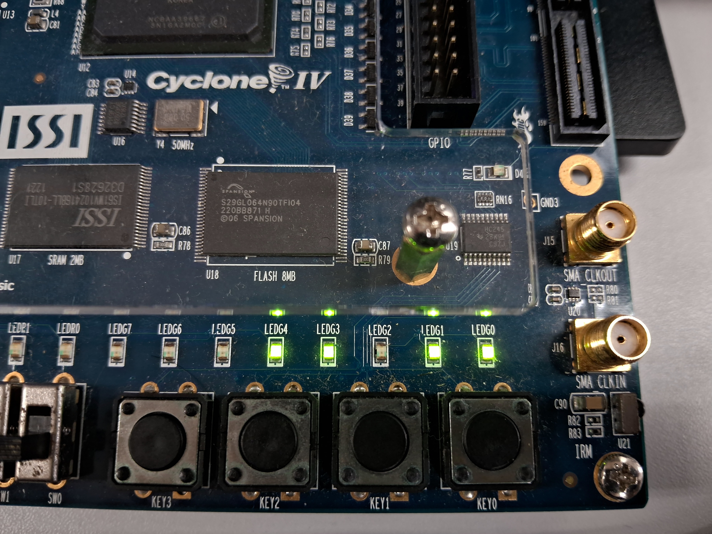

# Programa Matrícula

### Matrícula = ~~2025~~10703990

| Entrada | Valor | Binário |
|---------|------:|---------|
| M0       | 0     | `00000000` |
| M1      | 9     | `00001001` |
| M2      | 9     | `00001001` |
| M3      | 3     | `00000011` |
| M4      | 0     | `00000000` |
| M5      | 7     | `00000111` |
| M6      | 0     | `00000000` |
| M7      | 1     | `00000001` |

### Ordem das operações:

| Operação | Código | Saída esperada bin | decimal |
|----------|--------|--------------------|-----------|
| `ACC <- 7` | `0100000111` | `111` | 7 |
| `ACC <- ACC + 0` | `1000000000` | `111` | 7 |
| `ACC <- ACC + 9` | `1000001001` | `10000` | 16 |
| `ACC <- ACC + 3` | `1000000011` | `10011` | 19 |
| `ACC <- ACC - 1` | `1100000001` | `10010` | 18 |
| `ACC <- ACC - 0` | `1100000000` | `10010` | 18 |
| `ACC <- ACC + 0` | `1000000000` | `10010` | 18 |
| `ACC <- ACC + 9` | `1000001001` | `10010` | 27 |

### Saída esperada:

| Operação | Binário | Decimal |
|----------|---------|---------|
|`CPU_out <- ACC` | `11011` | 27 |

